# AegisX Universal Core API

[](https://nodejs.org/)
[](https://www.typescriptlang.org/)
[](https://www.fastify.io/)
[](https://www.postgresql.org/)
[](LICENSE)

> **Enterprise-grade Central Identity & Access Management Hub for Multi-Application Ecosystems**

AegisX is a powerful, flexible Core API that serves as the central hub for authentication, user management, and role-based access control across multiple applications. Built with modern technologies and designed for scalability.

## 🎯 Key Features

- **🔐 Centralized Authentication** - JWT RS256 + OAuth 2.0 for all applications
- **👥 User Management** - Complete user lifecycle with profiles and preferences  
- **🛡️ Advanced RBAC** - Role and permission-based access control
- **🏢 Flexible Multi-tenancy** - Start single-tenant, scale to multi-tenant
- **📊 Comprehensive Audit** - Complete activity logging and compliance
- **⚡ High Performance** - Built with Fastify and optimized for speed
- **🧪 Test-Driven** - 90%+ test coverage with modern testing tools
- **📈 Production-Ready** - Enterprise security and monitoring

## 🏗️ Architecture

AegisX follows a **Central Hub Model** where:
- **Core API** manages all authentication, users, and permissions
- **Applications** integrate with Core API for identity services
- **Frontend Apps** use standardized SDKs for authentication
- **Event-Driven** communication ensures real-time updates

```mermaid
graph TB
    subgraph "AegisX Core API"
        Auth["🔐 Authentication"]
        User["👤 User Management"] 
        RBAC["🛡️ RBAC Engine"]
        Tenant["🏢 Multi-tenant"]
    end
    
    subgraph "Application Ecosystem"
        App1["📝 Todo App"]
        App2["📊 CRM App"]
        App3["💼 HR System"]
    end
    
    Auth --> App1
    Auth --> App2
    Auth --> App3
    
    User --> App1
    User --> App2
    User --> App3
```



## 🚀 Quick Start

### Prerequisites
- Node.js 22 LTS
- PostgreSQL 15+
- Redis 7+
- Docker & Docker Compose

### Installation

```bash
# Clone the repository
git clone https://github.com/your-org/aegisx.git
cd aegisx

# Install dependencies
npm install

# Setup environment
cp .env.example .env

# Start development environment
docker-compose up -d

# Run database migrations
npm run db:migrate

# Start development server
npm run dev
```

### First Application Integration

```typescript
// Example: Integrate Todo App with AegisX
import { AegisXClient } from '@aegisx/client-sdk';

const aegisx = new AegisXClient({
  coreApiUrl: 'http://localhost:3000',
  clientId: 'your-app-client-id'
});

// Authenticate users
await aegisx.login();
const user = await aegisx.getUser();

// Check permissions
if (await aegisx.hasPermission('todo:create')) {
  // User can create todos
}
```

## 📚 Documentation

| Document | Description |
|----------|-------------|
| **[Project Summary](./aegisx-project-summary.md)** | Complete project overview and decisions |
| **[Architecture Specification](./aegisx-core-architecture.yaml)** | Detailed technical architecture |
| **[API Documentation](./docs/api.md)** | REST API endpoints and examples |
| **[Integration Guide](./docs/integration.md)** | How to integrate applications |
| **[Deployment Guide](./docs/deployment.md)** | Production deployment instructions |
| **[Development Guide](./docs/development.md)** | Local development setup |

## 🛠️ Technology Stack

### Core Technologies
- **Runtime**: Node.js 22 LTS
- **Framework**: Fastify 4.x  
- **Language**: TypeScript 5.x
- **Database**: PostgreSQL 15+ / Redis 7+
- **Message Queue**: RabbitMQ 3.12+
- **Testing**: Vitest + Playwright + Testcontainers

### Security & Performance
- **Authentication**: JWT RS256 + OAuth 2.0
- **Encryption**: bcrypt + AES-256-GCM
- **Caching**: Multi-layer Redis caching
- **Rate Limiting**: Distributed rate limiting
- **Monitoring**: Prometheus + Grafana + OpenTelemetry

## 🏢 Multi-Tenant Support

AegisX supports flexible multi-tenancy that can be enabled/disabled via configuration:

```env
# Single-tenant mode (default)
ENABLE_MULTI_TENANT=false

# Multi-tenant mode (enterprise)  
ENABLE_MULTI_TENANT=true
```

**Benefits:**
- ✅ Start simple with single-tenant
- ✅ Scale to multi-tenant without code changes
- ✅ Zero overhead when not needed
- ✅ Enterprise-ready when required

## 📊 Project Structure

```
aegisx-ecosystem/
├── aegisx-core/              # Core Identity API
│   ├── src/modules/          # Domain modules
│   │   ├── auth/            # Authentication
│   │   ├── user/            # User management  
│   │   ├── rbac/            # Authorization
│   │   └── tenant/          # Multi-tenancy
│   ├── database/            # Migrations & seeds
│   └── tests/               # Test suites
├── examples/
│   ├── todo-api/            # Example Todo application
│   └── frontend-apps/       # Example frontend apps
└── docs/                    # Documentation
```

## 🧪 Testing

```bash
# Run all tests
npm test

# Run with coverage
npm run test:coverage

# Run integration tests
npm run test:integration

# Run e2e tests  
npm run test:e2e
```

**Testing Strategy:**
- **Unit Tests**: 90%+ coverage with Vitest
- **Integration Tests**: Database + external services
- **E2E Tests**: Complete user workflows
- **Load Tests**: Performance and scalability

## 🚢 Deployment

### Development
```bash
docker-compose up -d
npm run dev
```

### Production
```bash
# Build for production
npm run build

# Deploy with Docker
docker build -t aegisx-core .
docker run -p 3000:3000 aegisx-core

# Deploy with Kubernetes
kubectl apply -f k8s/
```

## 📈 Performance

**Benchmarks:**
- **Response Time**: < 200ms for auth operations
- **Throughput**: 1000+ requests/second per instance
- **Availability**: 99.9% uptime target
- **Scalability**: Horizontal scaling support

## 🛡️ Security

AegisX implements enterprise-grade security:

- **Authentication**: Multi-factor authentication support
- **Authorization**: Fine-grained RBAC/PBAC  
- **Encryption**: Data at rest and in transit
- **Audit**: Comprehensive activity logging
- **Compliance**: GDPR, SOX, HIPAA ready

## 🤝 Contributing

We welcome contributions! Please see our [Contributing Guide](CONTRIBUTING.md) for details.

### Development Workflow
1. Fork the repository
2. Create a feature branch
3. Make your changes with tests
4. Submit a pull request

### Code Standards
- TypeScript strict mode
- 90%+ test coverage
- ESLint + Prettier formatting
- Conventional commits

## 📜 License

This project is licensed under the MIT License - see the [LICENSE](LICENSE) file for details.

## 🆘 Support

- **Documentation**: [docs.aegisx.dev](https://docs.aegisx.dev)
- **Issues**: [GitHub Issues](https://github.com/your-org/aegisx/issues)
- **Discussions**: [GitHub Discussions](https://github.com/your-org/aegisx/discussions)
- **Security**: security@aegisx.dev

## 🚀 Roadmap

### Current Version (v1.0)
- ✅ Core authentication and user management
- ✅ RBAC with roles and permissions
- ✅ Multi-tenant architecture support
- ✅ REST API with OpenAPI docs

### Upcoming (v1.1)
- 🔄 GraphQL API support
- 🔄 Advanced analytics dashboard
- 🔄 Mobile SDK for React Native
- 🔄 Plugin system for extensions

### Future (v2.0)
- 🔮 Machine learning for anomaly detection
- 🔮 Federated identity support
- 🔮 Edge computing deployment
- 🔮 Blockchain identity integration

---

**Built with ❤️ for modern application ecosystems**

*AegisX - Secure, Scalable, Simple* 