# AegisX Flow Diagrams Collection

## 📊 Overview

This document contains all the flow diagrams for AegisX Universal Core API project, providing visual representations of various processes, architectures, and user interactions.

---

## 🔐 Authentication Flows

### 1. User Login Flow (OAuth 2.0)

```mermaid
sequenceDiagram
    participant User as 👤 User
    participant App as 📱 Todo App
    participant Gateway as 🌐 API Gateway
    participant Core as 🔐 AegisX Core
    participant DB as 🗄️ Database
    
    User->>App: 1. Access Todo App
    App->>Gateway: 2. Check authentication
    Gateway->>App: 3. Not authenticated
    App->>Core: 4. Redirect to /auth/login
    
    User->>Core: 5. Enter email/password
    Core->>DB: 6. Validate credentials
    DB-->>Core: 7. User data
    Core->>Core: 8. Generate JWT tokens
    Core-->>App: 9. Return access + refresh tokens
    
    App->>App: 10. Store tokens securely
    App-->>User: 11. Login successful, show dashboard
```

### 2. JWT Token Validation Flow

```mermaid
sequenceDiagram
    participant App as 📱 Application
    participant Gateway as 🌐 API Gateway
    participant Core as 🔐 AegisX Core
    participant Cache as ⚡ Redis Cache
    
    App->>Gateway: 1. API Request + JWT
    Gateway->>Gateway: 2. Extract JWT from header
    Gateway->>Cache: 3. Check token blacklist
    Cache-->>Gateway: 4. Token status
    
    alt Token valid and not blacklisted
        Gateway->>Core: 5. Validate JWT signature
        Core-->>Gateway: 6. Token valid + user context
        Gateway->>Gateway: 7. Extract user permissions
        Gateway-->>App: 8. Forward request with user context
    else Token invalid or blacklisted
        Gateway-->>App: 9. 401 Unauthorized
    end
```

### 3. Token Refresh Flow

```mermaid
sequenceDiagram
    participant App as 📱 Application
    participant Core as 🔐 AegisX Core
    participant DB as 🗄️ Database
    participant Cache as ⚡ Redis Cache
    
    App->>Core: 1. POST /auth/refresh (refresh token)
    Core->>DB: 2. Validate refresh token
    DB-->>Core: 3. Token valid + user data
    
    Core->>Core: 4. Generate new access token
    Core->>Cache: 5. Store new token session
    Core->>DB: 6. Update refresh token (optional rotation)
    
    Core-->>App: 7. New access + refresh tokens
    App->>App: 8. Update stored tokens
```

---

## 👤 User Management Flows

### 4. User Registration Flow

### 5. User Profile Update Flow

```mermaid
sequenceDiagram
    participant User as 👤 User
    participant App as 📱 Application
    participant Core as 🔐 AegisX Core
    participant DB as 🗄️ Database
    participant Events as 📢 Event Bus
    
    User->>App: 1. Update profile info
    App->>Core: 2. PUT /users/me (with JWT)
    Core->>Core: 3. Validate JWT & permissions
    Core->>Core: 4. Validate input data
    Core->>DB: 5. Update user record
    DB-->>Core: 6. Updated user data
    Core->>Events: 7. Publish user.updated event
    Core-->>App: 8. Return updated profile
    App-->>User: 9. Show success message
    
    Events->>Events: 10. Notify other services
```

---

## 🛡️ RBAC (Role-Based Access Control) Flows

### 6. Permission Check Flow

### 7. Role Assignment Flow

```mermaid
sequenceDiagram
    participant Admin as 👨‍💼 Admin
    participant UI as 💻 Admin UI
    participant Core as 🔐 AegisX Core
    participant DB as 🗄️ Database
    participant Cache as ⚡ Cache
    participant Events as 📢 Events
    
    Admin->>UI: 1. Select user + role to assign
    UI->>Core: 2. POST /users/:id/roles
    Core->>Core: 3. Check admin permissions
    Core->>DB: 4. Validate user and role exist
    DB-->>Core: 5. Validation result
    Core->>DB: 6. Create user_role assignment
    Core->>Cache: 7. Invalidate user permission cache
    Core->>Events: 8. Publish role.assigned event
    Core-->>UI: 9. Assignment successful
    UI-->>Admin: 10. Show success notification
```

---

## 🏢 Multi-Tenant Flows

### 8. Tenant Switching Flow

### 9. Multi-Tenant Data Isolation Flow

---

## 📝 Application Integration Flows

### 10. Todo App Complete Flow

---

## 🏗️ System Architecture Flows

### 11. System Startup Flow

### 12. Event-Driven Communication Flow

```mermaid
sequenceDiagram
    participant UserAPI as 👤 User API
    participant EventBus as 📢 Event Bus
    participant TodoAPI as 📝 Todo API
    participant NotifyAPI as 📧 Notification API
    participant AuditAPI as 📊 Audit API
    
    UserAPI->>EventBus: 1. Publish user.created event
    EventBus->>TodoAPI: 2. user.created event
    EventBus->>NotifyAPI: 3. user.created event
    EventBus->>AuditAPI: 4. user.created event
    
    TodoAPI->>TodoAPI: 5. Create default todo list
    NotifyAPI->>NotifyAPI: 6. Send welcome email
    AuditAPI->>AuditAPI: 7. Log user creation
    
    TodoAPI->>EventBus: 8. Publish todo.list_created
    NotifyAPI->>EventBus: 9. Publish email.sent
    AuditAPI->>EventBus: 10. Publish audit.logged
```

---

## 🚀 Deployment Flows

### 13. CI/CD Pipeline Flow

### 14. Application Scaling Flow

---

## 🔄 Data Flow Diagrams

### 15. Request Processing Flow

### 16. Database Transaction Flow

```mermaid
sequenceDiagram
    participant API as 📱 API Service
    participant DB as 🗄️ Database
    participant Cache as ⚡ Redis
    participant Events as 📢 Event Bus
    
    API->>DB: 1. BEGIN TRANSACTION
    API->>DB: 2. INSERT user data
    API->>DB: 3. INSERT user_roles
    API->>DB: 4. INSERT audit_log
    
    alt All operations successful
        API->>DB: 5. COMMIT TRANSACTION
        API->>Cache: 6. Cache user data
        API->>Events: 7. Publish user.created
        API-->>API: 8. Return success
    else Any operation fails
        API->>DB: 5. ROLLBACK TRANSACTION
        API-->>API: 6. Return error
    end
```

---

## 📊 Monitoring & Analytics Flows

### 17. Health Check Flow

### 18. Error Handling Flow

---

## 🎯 Summary

These flow diagrams provide comprehensive visual documentation for:

- **Authentication & Authorization**: Complete OAuth 2.0 and JWT flows
- **User Management**: Registration, updates, and profile management
- **RBAC System**: Permission checking and role assignments
- **Multi-tenant Operations**: Tenant switching and data isolation
- **Application Integration**: End-to-end application flows
- **System Architecture**: Startup, scaling, and event-driven communication
- **Deployment**: CI/CD pipelines and scaling strategies
- **Data Processing**: Request handling and database transactions
- **Monitoring**: Health checks and error handling

Each diagram can be rendered using Mermaid and serves as both documentation and implementation guidance for the AegisX Universal Core API project. 